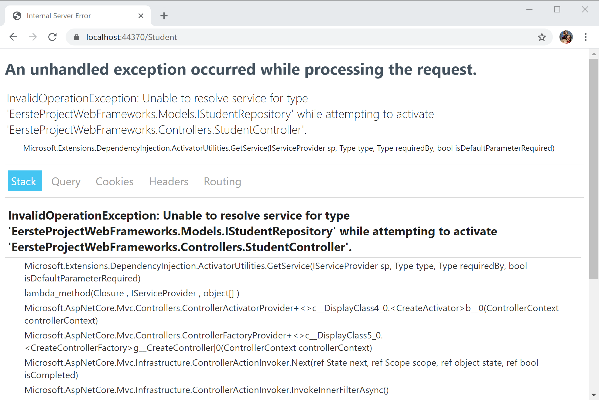

# Dependency Injection

Op dit moment hebben we gewoon in de `Controller` een lijst met objecten gemaakt en deze gebruikt om te tonen aan de gebruiker. We willen er voor zorgen dat onze applicatie klaar is voor het gebruik van een echte database, maar dit gaan we pas in latere hoofdstukken zien. We gaan dus tijdelijk de objecten in het geheugen bijhouden.

## Repository patroon

Om dit te verwezenlijken is er een bekend software patroon. Dit is het repository pattern. We maken een interface waarmee de applicatie kan `Student` objecten op te vragen zonder zich aan te trekken of deze opgeslagen wordt in een database of in memory.

We maken in de `Model` map een nieuwe `Interface` `IStudentRepostory` met de inhoud

```csharp
using System;
using System.Collections.Generic;
using System.Linq;
using System.Threading.Tasks;

namespace EersteProjectWebFrameworks.Models
{
    public interface IStudentRepository
    {
        IQueryable<Student> GetAll();
    }
}
```

We gebruiken hier `IEnumerable` als return type om hier zo algemeen mogelijk te zijn voor later. Dit zou even goed een `List` kunnen geweest zijn \(die `IEnumerable` interface implementeert\).

Nu maken we in de `Model` map een nieuwe klasse `StudentInMemoryRepository` die de `IStudentRepository` implementeerd.

```csharp
namespace EersteProjectWebFrameworks.Models
{
    public class StudentInMemoryRepository : IStudentRepository
    {
        private List<Student> students = new List<Student>();

        public StudentInMemoryRepository()
        {
            students.Add(new Student(0, "Andie", "Similon", 2020));
            students.Add(new Student(1, "Jon", "Beton", 2020));
        }

        public IEnumerable<Student> GetAll() {
        {
            return students;
        }
    }
}
```

We hebben hier een lijst met studenten en in de constructor vullen we de lijst op met een aantal default waarden. We implementeren de interface door de `GetAll` methode in te vullen. We geven hier gewoon de lijst van studenten terug.

We passen de `StudentsController` een beetje aan zodat we nu deze klasse gebruiken in plaats van elke keer de `List` aan te maken.

```csharp
namespace EersteProjectWebFrameworks.Controllers
{
    public class StudentController : Controller
    {
        private IStudentRepository studentRepository;
        public StudentController()
        {
            studentRepository = new StudentInMemoryRepository();
        }

        public IActionResult Index()
        {
            return View(studentRepository.GetAll());
        }
    }
}
```

We passen ook nog in `Views/Student` het `Index.cshtml` bestand aan dat dit ook gebruik maakt van de `IEnumerable` interface.

```text
@model IEnumerable<Student>
```

## Klasse afhankelijkheid

Men spreekt van een afhankelijkheid als een klasse een externe klasse nodig heeft om zijn werk te kunnen doen. Net zoals ik, wanneer ik dit lesmateriaal intyp, afhankelijk ben van bijvoorbeeld mijn computer. Verwijder de computer en ik zou het lesmateriaal niet kunnen voltooien.

In het voorbeeld van de `StudentController` is er een sterke afhankelijkheid ontstaan met de `StudentInMemoryRepository` klasse. De controller kan niet meer werken zonder.

Dependency injection in de klasse, die ze nodig heeft, is een goede manier om onze klassen te ontkoppelen. Alhoewel elke klasse zelf een nieuw object kan instanciëren en toegang heeft tot de methoden en eigenschappen ervan, is daarom niet zo dat die klasse daar thuis hoort. Het injecteren van een klassenafhankelijkheid is een goede manier om de single responsability patroon toe te passen. Dit patroon bevordert een goed objectgericht ontwerp. Dit principe houdt in dat elke klasse verantwoordelijkheid is voor een specifiek deel van de functionaliteit die door de applicatie wordt geleverd, en dat die verantwoordelijkheid volledig door de klasse moet worden ingekapseld.

## Inversion of control

Inversion of Control is een principe in software engineering waar de controle van objecten worden uitbesteed aan een framework \(in ons geval het framework van ASP.NET Core MVC\). De `StudentController` is niet meer verantwoordelijk voor het aanmaken van de `StudentInMemoryRepository` klasse, maar we vertrouwen er op dat het framework dit wel zal doen voor ons.

We passen dus de `StudentController` aan zodat de `IStudentRepository` via de constructor binnenkomt. We trekken ons dus niets aan van waar die komt, of wat de implementatie is.

```csharp
namespace EersteProjectWebFrameworks.Controllers
{
    public class StudentController : Controller
    {
        private IStudentRepository studentRepository;

        public StudentController(IStudentRepository studentRepository)
        {
            this.studentRepository = studentRepository;
        }

        public IActionResult Index()
        {
            return View(studentRepository.GetAll());
        }
    }
}
```

Als we de applicatie opstarten en naar de Students gaan zien dan krijgen we deze 'cryptische' error message:



Maar eigenlijk is deze niet zo cryptisch. Hij zegt dat we geen service kunnen vinden voor het type `IStudentRepository`. Dat klopt, we hebben ook nergens aangegeven wat voor repository het framework voor ons moet aanmaken, dus hij kan dit natuurlijk niet doen op dit moment.

Dit doen we in de `ConfigureServices` methode in de `Startup.cs` klasse.

```csharp
public void ConfigureServices(IServiceCollection services)
{
    services.AddControllersWithViews();

    services.AddSingleton<IStudentRepository, StudentInMemoryRepository>();
}
```

Hier geven we aan dat we een service registreren als een Singleton \(een klasse die 1 keer geinstantieerd wordt voor de gehele levensduur van de applicatie\). `IStudentRepository` is het soort interface dat je aanbiedt en `StudentInMemoryRepository` is de implementatie die het framework zal aanbieden. Dus elke keer als een `Controller` bijvoorbeeld een studenten repository wil, dan zal hij deze krijgen. Nu wordt het ook gemakkelijker om een ander soort `Repository` aan te bieden als we deze op termijn gaan vervangen met een echte database.

Nu zal het voorbeeld terug werken. Maar nu is de koppeling tussen de `StudentController` en de `StudentInMemoryRepository` volledig weg gewerkt.

## Oefeningen

Voeg een `Create` methode toe aan de `IStudentRepository` waarmee je nieuwe `Student` objecten kan opslaan. Zorg ervoor dat deze automatisch een Id krijgt toegewezen die 1 hoger is als de vorige. De signature van deze methode is

```csharp
public void Create(Student student);
```

Voeg een `Get` methode toe met als argument id die het element opvraagt met de meegegeven `Id`. De signature van deze methode is.

```csharp
public Student Get(int id);
```

We gaan deze methoden in een later hoofdstuk nodig hebben.

