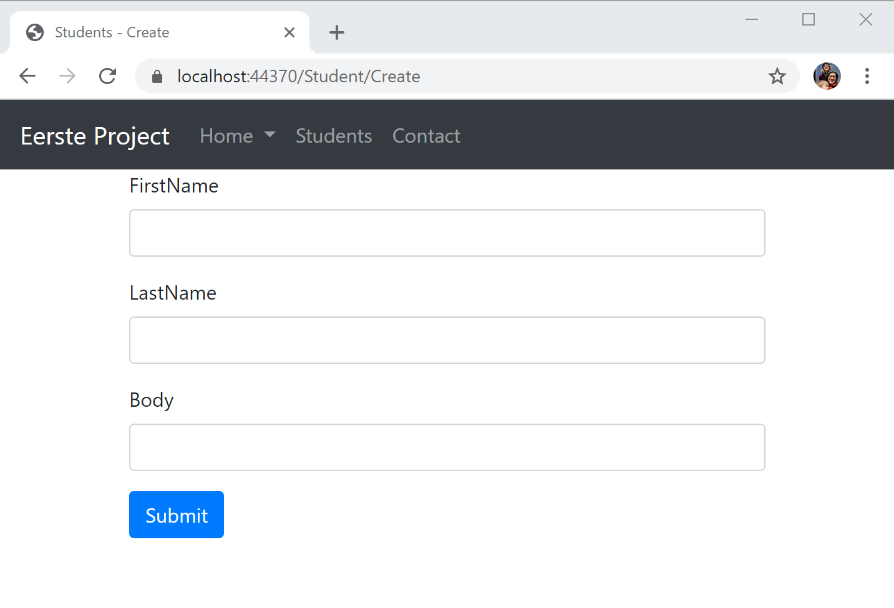

# Formulieren

In dit deel gaan we leren hoe we een formulier aanmaken in html code en vervolgens deze doorsturen naar de controller. Ook validatie van de gegevens zal hier kort aan bod komen.

## Het formulier aanmaken

We gaan verder gaan met de `StudentController` die we in vorig deeltje hebben aangemaakt. Hier maken we een nieuwe actie `Create` aan om een nieuwe student aan te maken. 

```csharp
public IActionResult Create()
{

    return View();
}
```

Momenteel doet deze actie nog niet veel. We moeten ook nog een view aanmaken hiervoor. We maken dus een nieuw bestand `Create.cshthml` met de inhoud:

```html
@{
    Layout = "_Layout";
    ViewBag.Title = "Students - Create";
}
<form method="post" asp-controller="Student" asp-action="Create">
    <div class="form-group">
        <label for="FirstName">FirstName</label>
        <input type="text" class="form-control" id="firstName" name="FirstName">
    </div>
    <div class="form-group">
        <label for="topic">LastName</label>
        <input type="text" class="form-control" id="lastName" name="LastName">
    </div>
    <div class="form-group">
        <label for="body">Body</label>
        <input type="number" class="form-control" id="enrollmentYear" name="EnrollmentYear">
    </div>
    <button type="submit" class="btn btn-primary">Submit</button>
</form>
```

We willen het formulier via een `post` methode versturen. Dit is gangbaar bij formulieren. Het alternatief is via een `get` methode maar dan komen alle doorgestuurde variabelen in de url te staan en dit is niet wenselijk. 

Je merkt hierboven dat we gebruik maken van de taghelpers `asp-controller` en `asp-action` om de juiste action te gebruiken voor het formulier. Zo zal het formulier worden doorgestuurd naar de `Create` action van de `StudentController`.

De rest van het formulier is standaard html en gebruik gemaakt van bootstrap om te stijlen. Meer informatie kan je vinden op https://getbootstrap.com/docs/4.0/components/forms/



Als we nu het formulier doorsturen door op submit te drukken gebeurt er uiteraard niet veel. We moeten nog controller code schrijven om met deze doorgestuurde gegevens te kunnen werken.

We voegen dus een extra action toe aan de `StudentController`. Deze zal ook `Create` noemen maar zal de andere `Create` action overloaden

```csharp
[HttpPost]
public IActionResult Create([FromForm] string firstName, [FromForm] string lastName, [FromForm] int enrollmentYear)
{
    Student student = new Student(0, firstName, lastName, enrollmentYear);
    return View(student);
}
```

We overlopen even de nieuwe dingen hier:
- `[HttpPost]` is een `Attribute` die aangeeft dat deze action enkel moet gebruikt worden bij een POST vanuit een formulier. Zo heb je voor alle http methoden (GET, POST, DELETE,...) een eigen variant.
- Als argumenten van de methode `Create` gebruiken we de argumenten die we doorsturen vanuit het formulier. De namen moeten overeenkomen met de `name` uit het formulier in html. Dit kan je niet wijzigen, zorg er dus altijd voor dat deze overeenkomen.
- We maken hier een instantie van Student aan met de waarden die zijn doorgegeven. We geven deze tijdelijk een `Id` 0 omdat deze nog niet nodig is in deze context.
- We geven deze mee aan de `View` zodat de toegevoegde Student kan worden weergegeven.
- Eigenlijk doen we nog altijd niets met het student dus deze wordt hier nog nergens opgeslagen.

Om nu aan te geven dat het gelukt is doen we nog een kleine aanpassing aan het `Create.cshtml` bestand

```html
@model Student
@{
    Layout = "_Layout";
    ViewBag.Title = "Students - Create";
}
@if (Model != null)
{
    <div class="alert alert-success" role="alert">
        @Model.FirstName @Model.LastName was succesfully added.
    </div>
}
...Rest van het formulier blijft hetzelfde....
```

- We geven aan dat het model waar deze view mee geassocieerd is de `Student` klasse is zodat we deze kunnen meegeven vanuit de `StudentController`. 
- We kijken hier of het `Model` niet gelijk is aan null, dit betekend dus dat het object bestaat en dus is doorgegeven. Als dit het geval is tonen we een melding dat de gebruiker is toegevoegd. Let op de @ notatie bij de if en het gebruik van het Model. 

