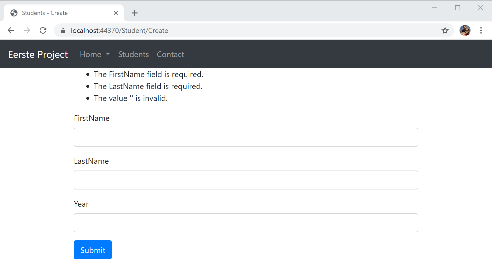

# Formulieren

In dit deel gaan we leren hoe we een formulier aanmaken in html code en vervolgens deze doorsturen naar de controller. Ook validatie van de gegevens zal hier kort aan bod komen.

## Formulier via argumenten

We gaan verder gaan met de `StudentController` die we in vorig deeltje hebben aangemaakt. Hier maken we een nieuwe actie `Create` aan om een nieuwe student aan te maken.

```csharp
public IActionResult Create()
{
    return View();
}
```

Momenteel doet deze actie nog niet veel. We moeten ook nog een view aanmaken hiervoor. We maken dus een nieuw bestand `Create.cshthml` met de inhoud:

```markup
@{
    Layout = "_Layout";
    ViewBag.Title = "Students - Create";
}
<form method="post" asp-controller="Student" asp-action="Create">
    <div class="form-group">
        <label for="FirstName">FirstName</label>
        <input type="text" class="form-control" id="firstName" name="FirstName">
    </div>
    <div class="form-group">
        <label for="topic">LastName</label>
        <input type="text" class="form-control" id="lastName" name="LastName">
    </div>
    <div class="form-group">
        <label for="body">Year</label>
        <input type="number" class="form-control" id="enrollmentYear" name="EnrollmentYear">
    </div>
    <button type="submit" class="btn btn-primary">Submit</button>
</form>
```

We willen het formulier via een `post` methode versturen. Dit is gangbaar bij formulieren. Het alternatief is via een `get` methode maar dan komen alle doorgestuurde variabelen in de url te staan en dit is niet wenselijk.

Je merkt hierboven dat we gebruik maken van de taghelpers `asp-controller` en `asp-action` om de juiste action te gebruiken voor het formulier. Zo zal het formulier worden doorgestuurd naar de `Create` action van de `StudentController`.

De rest van het formulier is standaard html en gebruik gemaakt van bootstrap om te stijlen. Meer informatie kan je vinden op [https://getbootstrap.com/docs/4.0/components/forms/](https://getbootstrap.com/docs/4.0/components/forms/)


Als we nu het formulier doorsturen door op submit te drukken gebeurt er uiteraard niet veel. We moeten nog controller code schrijven om met deze doorgestuurde gegevens te kunnen werken.

We voegen dus een extra action toe aan de `StudentController`. Deze zal ook `Create` noemen maar zal de andere `Create` action overloaden

```csharp
[HttpPost]
public IActionResult Create([FromForm] string firstName, [FromForm] string lastName, [FromForm] int enrollmentYear)
{
    Student student = new Student(0, firstName, lastName, enrollmentYear);
    studentRepository.Create(student);
    return RedirectToAction("Index", "Student");
}
```

We overlopen even de nieuwe dingen hier:

* `[HttpPost]` is een `Attribute` die aangeeft dat deze action enkel moet gebruikt worden bij een POST vanuit een formulier. Zo heb je voor alle http methoden \(GET, POST, DELETE,...\) een eigen variant.
* Als argumenten van de methode `Create` gebruiken we de argumenten die we doorsturen vanuit het formulier. De namen moeten overeenkomen met de `name` uit het formulier in html. Dit kan je niet wijzigen, zorg er dus altijd voor dat deze overeenkomen.
* We maken hier een instantie van Student aan met de waarden die zijn doorgegeven. 
* We voegen deze toe aan de `studentRepository` met de zelfgemaakte `Create` methode.
* Omdat we bij het succesvol toevoegen van een gebruiker terug de lijst van studenten willen laten zien gebruiken we hier de `RedirectToAction` die als eerste argument de `Action` aanneemt en als 2de de `Controller`.

## Model Binding

De manier die we hierboven hebben beschreven is omslachtig. We willen hier gebruik maken van model binding om het formulier automatisch om te zetten naar een object. We passen de `Create` action aan van de `StudentController`

```csharp
[HttpPost]
public IActionResult Create(Student student)
{
    studentRepository.Create(student);
    return RedirectToAction("Index", "Student");
}
```

We gebruiken hier gewoon de `Student` klasse als argument van de methode en de omzetting van de form body wordt automatisch voor jou gedaan. Er zijn hier een paar kleine dingen waar je moet op letten:

* Zorg voor een empty constructor voor de klasse waar je wil gebruiken voor het binden.

  ```csharp
    public Student()
    {

    }
  ```

* Zorg ervoor dat de properties van de klasse overeenkomen met de name attributen van het form element.

Als je nu terug naar de web applicatie gaat zal je zien dat het gedrag ongewijzigd blijft.

## Model Validatie

Zoals je misschien wel al opgemerkt hebt kan je in ons formulier invullen wat je wil. Laat je velden leeg, dan zal er ook een `Student` aangemaakt worden. Dit willen we uiteraard niet.

Microsoft heeft een zeer effectieve en gemakkelijk te gebruiken gegevensvalidering API ontwikkeld in de kern .NET Framework met de naam Data Annotations. Zoals de naam impliceert, biedt de met de naam Data Annotations API een set .NET attributen die ontwikkelaars kunnen toegepassen op klasse-eigenschappen van data-objecten. Deze eigenschappen bieden een declaratieve manier om validatieregels rechtstreeks op een model toe te passen.

### Verplichte velden

Alle velden in onze `Student` klasse zijn verplicht \(buiten de `Id` momenteel\). Om dit aan te geven gebruiken we het `[Required]` attribuut. We geven dit dus ook aan in de `Student` klasse.

```csharp
[Required]
public string FirstName { get; set; }

[Required]
public string LastName { get; set; }

[Required]
public int EnrollmentYear { get; set; }
```

### Andere attributen

Er zijn nog veel andere attributen. Zo vindt je op de [officiele documentatie](https://docs.microsoft.com/en-us/aspnet/core/mvc/models/validation?view=aspnetcore-3.1#built-in-attributes).

Zo kan bijvoorbeeld het `Range` attribuut wel interessant zijn voor het jaartal van de `EnrollmentYear`. We willen bijvoorbeeld alleen getallen tussen 2010 en 2022 toelaten.

```csharp
[Range(2010, 2021)]
[Required]
public int EnrollmentYear { get; set; }
```

### ModelState

Wanneer het ASP.NET MVC Framework de actiemethode van een controller uitvoert kan je ook de gegevens die worden doorgegeven aan die controller actiemethode validereren. Foutmeldingen worden opgeslagen in een ModelState object. Controller acties kunnen de ModelState opvragen om na te gaan of de request geldig is en die overeenkomstig te reageren. Als een veld niet correct is ingevuld kan je de gebruiker laten terugkeren naar de pagina met invulformulier om de validatie fouten te corrigeren en een nieuwe request in te dienen.

```csharp
[HttpPost]
public IActionResult Create(Student student)
{
    if (ModelState.IsValid)
    {
        studentRepository.Create(student);
        return RedirectToAction("Index", "Student");
    }
    return View();
}
```

### Validatie foutmeldingen tonen

We weten nu al hoe we validatie foutmeldingen moeten maken, maar nog niet hoe we die aan de gebruiker moeten tonen. Dat gebeurt op een andere plaats in de MVC architectuur, namelijk in de view. We gaan dus naar de `Create.cshtml` view.

Als we ons niet te veel van de layout aantrekken en we gewoon een lijstje willen laten zien kunnen we gebruik maken van `@Html.ValidationSummary()` wat een overzicht van alle validatie fouten laat zien in html.



Dan wordt `Create.cshtml` gewoon 

```html
@model Student
@{
    Layout = "_Layout";
    ViewBag.Title = "Students - Create";
}
@Html.ValidationSummary()
<form method="post" asp-controller="Student" asp-action="Create">
    ...
</form>
``` 

Wat we eigenlijk willen doen is een error laten zien bij het juiste input veld. We zullen verder zien hoe we dit doen.

## TempData

We hebben in de `Create` action van de `StudentController` gebruik gemaakt van `RedirectToAction` om na het toevoegen terug naar de lijst van studenten te gaan. We zouden graag ook nog een message willen meegeven aan deze view als het toevoegen gelukt is. Je zou denken dat dit een goede use case is voor het gebruik van een `ViewBag` maar als je dit zou proberen zal dit niet werken. Hiervoor bestaat het `TempData` object. Dit object blijft bestaan tussen een redirect dus is hier ideaal voor.

We passen de `Create` action aan zodat er in TempData een message wordt gestoken als het toevoegen gelukt is.

```csharp
[HttpPost]
public IActionResult Create(Student student)
{
    if (ModelState.IsValid)
    {
        studentRepository.Create(student);
        TempData["Message"] = $"{student.FirstName} {student.LastName} was added succesfully";
        return RedirectToAction("Index", "Student");
    }
    return View();
}
```

Nu is het enige wat we nog moeten doen is het aanpassen van de `Index.cshtml` view zodat het dit bericht laat zien als het meegegeven wordt.

```html
@model IEnumerable<Student>
@{
    Layout = "_Layout";
    ViewBag.Title = "Students";
}
@if (TempData["Message"] != null) {
<div class="alert alert-success" role="alert">
    @TempData["Message"]
</div>
...
}
```


## Tag helpers

Je zult hopelijk al opgemerkt hebben dat het vrij veel werk is om de `name` en `id` attributen opgelijnd te houden met het model. Als er iets veranderd in het model dan moeten deze in het formulier ook aangepast worden. Hiervoor zijn er een aantal handige tag helpers.

### Input tag helper

De Input Tag Helper bindt een HTML `<input>` element aan property van het model.

Syntax:

```markup
<input asp-for="<Expression Name>">
```

Deze genereert de `id` en `name` attributen voor het input veld. Het vult ook dynamisch het `type` attribuut in van het input veld gebaseerd op het type in het model.

Zo zal in onze `Create.cshtml` het formulier er al veel overzichtelijker worden:

```markup
...
<div class="form-group">
    <label for="FirstName">FirstName</label>
    <input type="text" class="form-control" asp-for="FirstName">
</div>
<div class="form-group">
    <label for="topic">LastName</label>
    <input type="text" class="form-control" asp-for="LastName">
</div>
<div class="form-group">
    <label for="body">Year</label>
    <input type="number" class="form-control" asp-for="EnrollmentYear">
</div>
...
```

Label Tag helper en error tag helper!!!