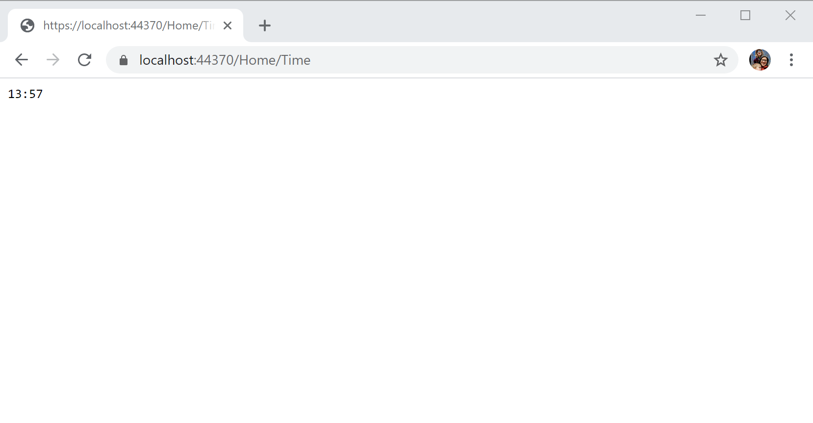
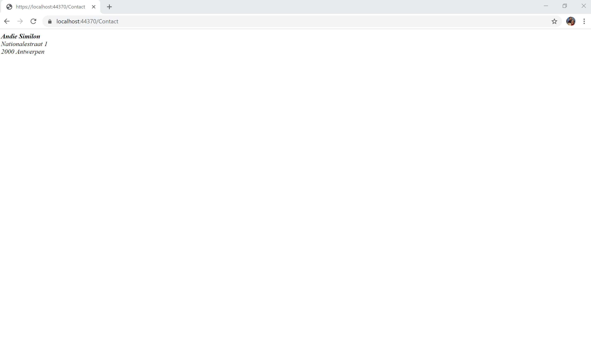

# Views en Controllers

## Inleiding

In het vorige hoofdstuk hebben we een eenvoudig project aangemaakt waar er gebruik gemaakt wordt van een endpoint waar er via

```csharp
await context.Response.WriteAsync("Hello World!");
```

rechstreeks naar de response stream werd geschreven. Dit is uiteraard zeer omslachtig als je dit zou moeten doen voor elke web pagina van jouw webapplicatie. We gaan hier gebruik maken van ASP.NET MVC \(Model View Controller\) om dit te vereenvoudigen.

## MVC Configureren

Om ons project van vorig hoofdstuk klaar te maken voor MVC moeten we een aantal aanpassingen maken aan het `Startup.cs` bestand.

```csharp
public void ConfigureServices(IServiceCollection services)
{
    services.AddControllersWithViews();
}
```

Bovenstaande code zal ondersteuning voor Controllers en Views \(Razor Views\) toevoegen aan je project en deze configureren.

```csharp
public void Configure(IApplicationBuilder app, IWebHostEnvironment env)
{
    if (env.IsDevelopment())
    {
        app.UseDeveloperExceptionPage();
    }

    app.UseRouting();

    app.UseEndpoints(endpoints =>
    {
        endpoints.MapControllerRoute(
            name: "default",
            pattern: "{controller=Home}/{action=Index}/{id?}");
    });
}
```

We gaan hier niet meer zelf de routes definieren en zelf de resultaten naar de response stream schrijven. We vervangen dit door `endpoints.MapControllerRoute` waar we een naam en een pattern meegeven.

Het pattern geeft aan welke pattroon de urls van de web applicatie zullen volgen. Gewoonlijk moeten we dit niet aanpassen in de meeste web applicaties.

Het pattern opgesplitst en uitgelegd geeft dit:

* **`{controller=Home}`** 
  * Dit geeft aan dat HomeController de default controller is. Dus als de gebruiker naar de hoofdpagina surft dat dan default de HomeController gebruikt zal worden.
* **`{action=Index}`** 
  * Dit geeft aan dat Index de default action is als er geen wordt opgegeven.
* **`{id?}`**
  * Er wordt gebruikt van een optionele id die mag weggelaten worden. Dit wordt aangegeven door een vraagteken in de url

Deze applicatie mist uiteraard nog een Controller voordat we deze kunnen opstarten.

## Conventie boven configuratie

Dit betekent dat, in plaats van te vertrouwen op expliciete configuratie-instellingen, ASP.NET MVC gewoon ervan uit gaat dat de ontwikkelaars bepaalde conventies zullen volgen bij het bouwen van hun applicaties. De folderstructuur voor ASP.NET MVC project is een goed voorbeeld van het gebruik van de conventie eerder dan de configuratie. Er zijn drie speciale mappen in het project die overeenkomen met de elementen van het MVC patroon: de **Controllers**, **Models**, en **Views** mappen.

Het is in één oogopslag duidelijk wat elk van deze mappen bevat. De figuur _De structuur van een ASP.NET MVC projectfolder_ is overduidelijk.

Als je kijkt naar de inhoud van deze mappen, ga je nog meer conventies tegenkomen.


De Controllers map bevat niet alleen alle controller klassen van de toepassing, maar de controller klassen volgen allemaal de conventie om hun namen te beëindigen met het **Controller** achtervoegsel. Het framework gebruikt deze conventie om controllers van de toepassing te registreren bij het opstarten en de controllers te associëren met de bijbehorende routes.

De afspraak is dat alle views van de applicatie in de folder **Views** staan. Maar de afspraken gaan nog verder. De **Views** map wordt verder onderverdeeld in submappen:

1. een **Shared** map;
2. een optionele map die de views voor elke controller bevatten;

## Controller

Zoals al aangegeven moeten alle controllers in een map Controllers staan. Maak eerst de map Controllers aan en maak daarna een **Empty Controller Class** aan met de naam HomeController.


Pas de inhoud van het nieuw aangemaakte `HomeController.cs`aan.

```csharp
public class HomeController : Controller
{
    public String Index()
    {
        return "Hello World!";
    }
}
```

Dit zal er voor zorgen dat de gebruiker **Hello World** te zien krijgt als hij naar de root pagina surft. We gaan de applicatie opstarten aan de hand van Visual Studio deze keer. Klik op **Debug &gt; Start debugging** om de applicatie in debug modus op te starten.


Wat we hier hebben gemaakt is gewoon een methode `Index()` die een String heeft als return waarde. Index staat voor de hoofdpagina van deze bepaalde controller. Dus eigenlijk zouden we evengoed naar [https://localhost:44370/Home/Index](https://localhost:44370/Home/Index) hebben kunnen surfen om deze pagina te zien te krijgen. `Home` was hier de default controller dus moesten we deze niet opgeven en `Index` kan je ook weglaten. De Index methode is wat we in MVC een **Action** noemen. We zullen straks nog nieuwe actions toevoegen als voorbeeld.

We willen uiteraard niet enkel de gebruiker een simpele string laten zien. Wat we echt willen is de gebruiker een html pagina laten zien met een bepaalde opmaak. Daarom gaan we nu het concept Views introduceren. We komen straks nog eens terug op het MVC concept als we ze alle drie hebben aangemaakt in het voorbeeld.

## Views

Als we willen dat de Index action een echte webpagina teruggeeft moeten we deze methode iets aanpassen:

```csharp
public ActionResult Index()
{
    return View();
}
```

In plaats van een `String` geven we hier een `ActionResult` als return type terug. Dit is de base class van alle view results van een `Action` . We gebruiken deze omdat we nog niet zeker weten wat deze Action allemaal zal teruggeven. Als we bijvoorbeeld zeker weten dat het enkel een View zal teruggeven hadden we ook `ViewResult` kunnen gebruiken. Maar omdat we ook errors zouden willen laten zien houden we best dit zo algemeen mogelijk.

Voor een ViewResult object aan te maken gebruiken we de `View` functie. Hier geven we geen argumenten mee. Dit komt overeen met een View waarvan de View naam overeenkomt met de naam van de action.

Als je nu terug de web applicatie opstart en naar de root page gaat dan krijg je het volgende te zien:


Dit zegt exact wat er nog moet gebeuren. We moeten nog een View aanmaken met de naam `Index.cshtml` en deze moeten we in de map Views/Home plaatsen. Deze mappen moeten zelf nog aangemaakt worden. Per conventie moet je altijd een map aanmaken in de Views map met de naam van de Controller zonder het deel Controller. Dus in ons geval is dit Home, wat dus HomeController zonder het deel Controller is.


We passen de inhoud van het Index.cshtml bestand aan naar het onder

```markup
@{
}
<!DOCTYPE html>
<html>
<head>
    <title>Hello World</title>
</head>

<body>
    <h1>Hello World</h1>
</body>

</html>
```

Als we nu terug naar de pagina surfen dan krijgen we een al iets mooier gestijlde pagina te zien.


## Static content

De meeste web applicaties bestaan uiteraard niet alleen maar uit html paginas. Ze bevatten meestal javascript bestanden, css bestanden, afbeeldingen,... Om hier ook ondersteuning voor te bieden moet er nog een ding aangepast worden aan de `Configure` method van de Startup klasse

```csharp
public void Configure(IApplicationBuilder app, IWebHostEnvironment env)
{
    if (env.IsDevelopment())
    {
        app.UseDeveloperExceptionPage();
    }

    app.UseRouting();

    app.UseStaticFiles();

    app.UseEndpoints(endpoints =>
    {
        endpoints.MapControllerRoute(
            name: "default",
            pattern: "{controller=Home}/{action=Index}/{id?}");
    });
}
```

Dit zorgt ervoor dat alle bestanden onder de wwwroot folder beschikbaar worden voor gebruik in webpaginas. Maak dus in je project een nieuwe map `wwwroot` en maak daar een map `images` in. We plaatsen daar een afbeelding:


Als je nu onze `index.cshtml` pagina aanpassen met de volgende inhoud

```markup
@{
}
<!DOCTYPE html>
<html>
<head>
    <title>Hello World</title>
</head>

<body>
    <h1>Hello World</h1>
    
</body>

</html>
```

en onze web applicatie terug starten dan krijgen we de volgende webpagina te zien:


## Oefeningen

Maak in de bestaande `HomeController` een nieuwe action aan die het uur en de minuten laat zien. Noem deze action `Time`.



Maak een nieuwe Controller aan `ContactController` en maak een nieuwe `Index` action aan. Maak een View aan die je naam en adres laat zien.



