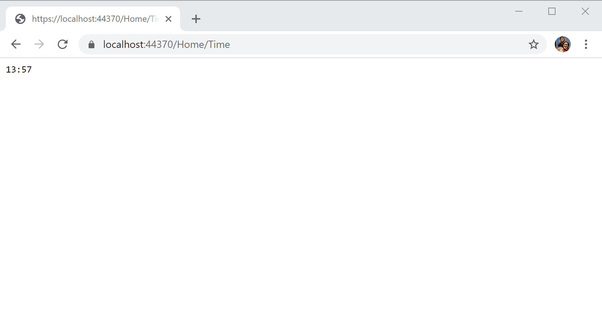
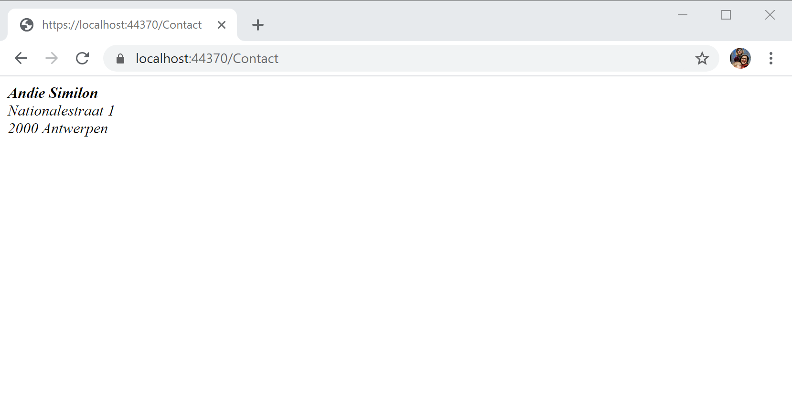
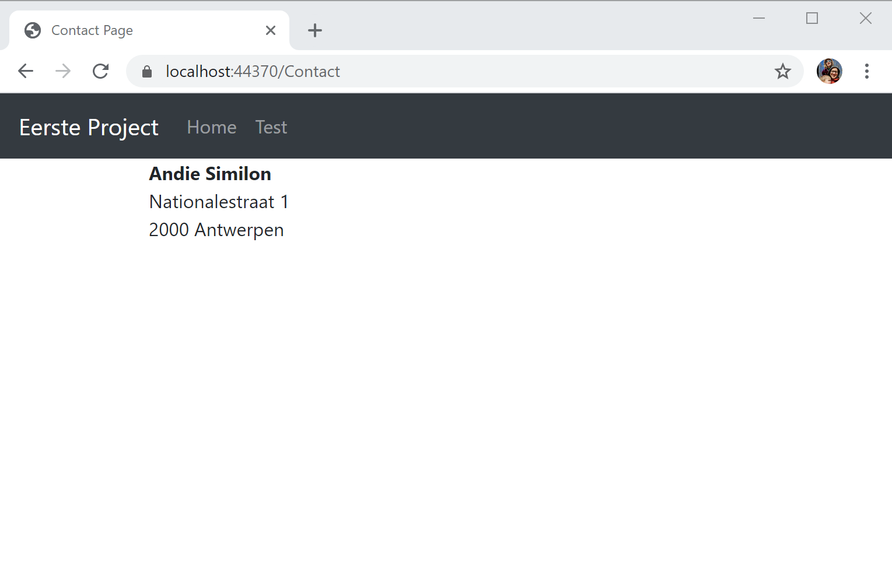

# Vragensessie

Maak in de bestaande `HomeController` een nieuwe action aan die het uur en de minuten laat zien. Noem deze action `Time`.

* Maak een nieuwe Controller aan `ContactController` en maak een nieuwe `Index` action aan. Maak een View aan die je naam en adres laat zien.

* Pas nu de View van de Contact pagina aan zodat deze ook in de layout met de navigatie balk komt.

* Pas het bestand `Shared/_Layout.cshtml` aan zodat er een navigatie structuur ontstaat. Alle links moeten gegenereerd worden door tag helpers. Een voorbeeld hoe je dropdown menu maakt in bootstrap kan je vinden op [https://getbootstrap.com/docs/4.0/components/navbar/](https://getbootstrap.com/docs/4.0/components/navbar/)

