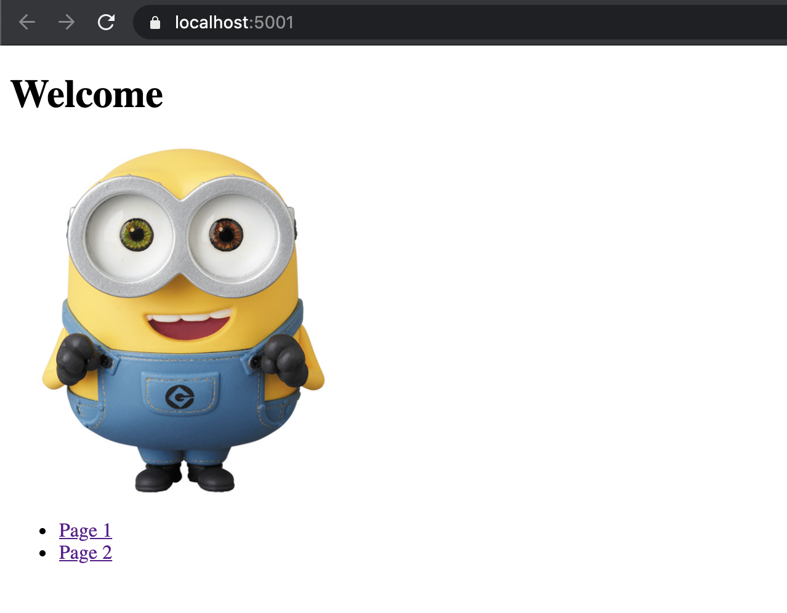

# Oefeningen

### **Oefening 1**

* Volg de instructies om een **'EersteOefening'** project aan te maken zoals beschreven in het deel 'Project aanmaken'.
* Zorg dat je een **OefeningController** hebt met bijbehorende **Index** action. Deze moet een **View** laten zien die de volgende pagina laat zien aan de gebruiker. 

* Page 1 moet een link zijn naar **/Oefening/Page1**. Hiervoor moet dus een extra `Page1` action aangemaakt worden in de `OefeningController` . Als je hier naartoe gaat dan moet je gewoon de string "Page1" laten zien:

* Page 2 moet een link zijn naar **/Oefening/Page2**. En als je daar naartoe gaat dan moet je de volgende pagina laten zien. Dit moet wel met een view gebeuren.

