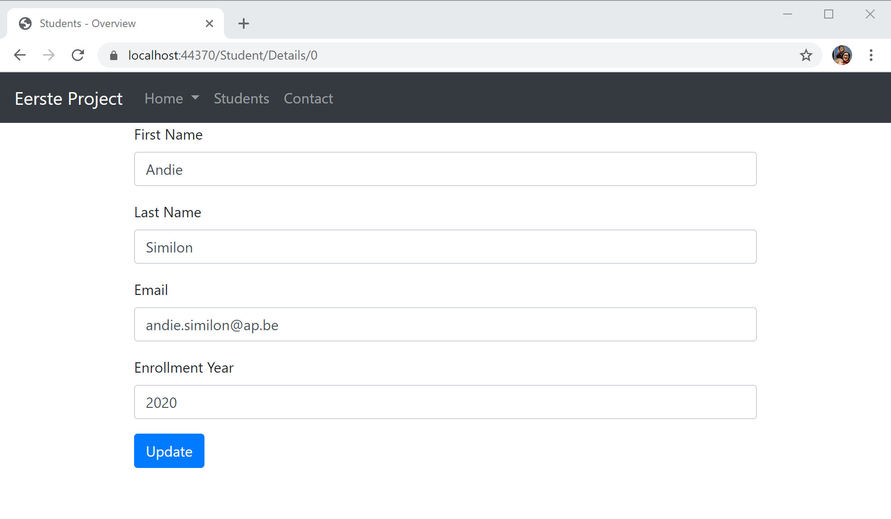
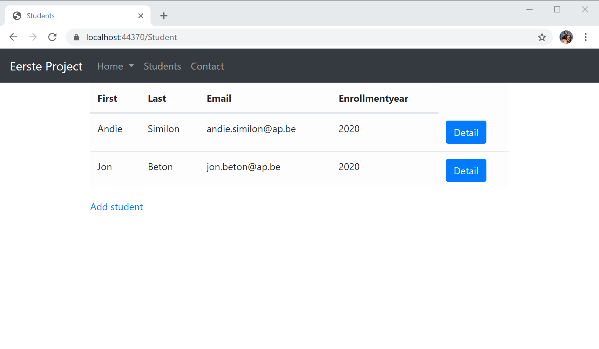

# Routering

## Conventionele routing

We hebben in een van de voorgaande hoofdstukken geleerd hoe we in de `Startup` klasse routing op zetten aan de hand van een pattern:

```csharp
app.UseEndpoints(endpoints =>
{
    endpoints.MapControllerRoute(
        name: "default",
        pattern: "{controller=Home}/{action=Index}/{id?}");
});
```

Dit is een voorbeeld van conventionele routing. Het noemt conventionele routing omdat het een conventie vastlegt voor URL paden. Even een herhaling van wat dit allemaal weer betekende:

* Het `{controller=Home}` deel komt overeen met de controller naam en zet deze default op Home als deze weggelaten wordt.
* Het `{action=Index}` gedeelte komt overeen met de actie
* en het laatste deel is gebruikt voor een optionele id. De `?` in het pad maakt het optioneel. 

Dus bijvoorbeeld:

* `/Products/List` komt overeen met de `ProductsController.List` action.
* `/Blog/Article/17` mapt naar de `BlogController.Article` en bindt de id parameter aan 17.

Omdat we gebruik maken van conventionele routing moeten we niet voor elke actie een nieuw pad definieren en helpt dit om consistentie in de urls te bewaren.

Voordat we verder gaan gaan we even de lijst met producten in een private field zetten zodat deze beschikbaar is voor alle acties

```csharp
private List<Product> products = new List<Product>
{
    new Product { Id = 1, Name = "Fluffy Llama", Description = "A fluffy llama for the kids", Price = 9.99M },
    new Product { Id = 2, Name = "Colorful llama", Description = "A colorful llama for the larger kids", Price = 19.99M }
};
```

We gaan nu een Detail page aanmaken voor de producten zodat we elk product in detail kunnen bekijken door door te klikken op de overzichtspagina. We willen dit volgens het pad `/Product/Details/{id}` doen. We maken dus een nieuwe action `Details` aan in de `Product` controller.

```csharp
public IActionResult Details(int id)
{
    foreach (Product product in products)
    {
        if (product.Id == id)
        {
            return View(product);
        }
    }
    return NotFound();
}
```

Zoals je ziet zal de argument `id` automatisch gemapped worden naar de parameter in het pad. We gebruiken onze `products` lijst hier om de gevraagde student op te vragen. Als deze niet gevonden wordt  geven we `NotFound` terug wat zal mappen naar een http error code 404. Als deze wel gevonden wordt dan zal de details page worden getoond, dit zal weer een formulier zijn om de student aan te passen. We maken dus een view `Details.cshtml` aan.

```markup
@model Student
@{
    Layout = "_Layout";
    ViewBag.Title = "Students - Overview";
}
<form method="post" asp-controller="Student" asp-action="Update" asp-route-id="@Model.Id">
    <div class="form-group">
        <label asp-for="FirstName"></label>
        <input class="form-control" asp-for="FirstName">
        <span class="text-danger" asp-validation-for="FirstName"></span>
    </div>
    <div class="form-group">
        <label asp-for="LastName"></label>
        <input class="form-control" asp-for="LastName">
        <span class="text-danger" asp-validation-for="LastName"></span>
    </div>
    <div class="form-group">
        <label asp-for="Email"></label>
        <input class="form-control" asp-for="Email">
        <span class="text-danger" asp-validation-for="Email"></span>
    </div>
    <div class="form-group">
        <label asp-for="EnrollmentYear"></label>
        <input class="form-control" asp-for="EnrollmentYear">
        <span class="text-danger" asp-validation-for="EnrollmentYear"></span>
    </div>
    <button type="submit" class="btn btn-primary">Update</button>
</form>
```

Dit is bijna een volledige kopie van het formulier uit de `Create`. We leren later hoe we deze code kunnen apart plaatsen en kunnen hergebruiken aan de hand van partial views.

### Route Tag Helper

We hebben al hiervoor geleerd hoe we links maken aan de hand van de link tag helper. Zo kunnen we dus een link maken naar de `Details` action van de `StudentController`. Maar we missen hier nog een manier om de `id` mee te geven van de route. Hiervoor hebben we de `asp-route-*` tag helper. De \* kan je hier vervangen met de naam van het argument. In dit geval is dit dus `asp-route-id`.

Een link naar de detail pagina kan dan zijn

```markup
<a asp-action="Details" asp-controller="Student" asp-route-id="2">Detail</a>
```



### Oefeningen

Zorg ervoor dat elke rij in het overzicht van de studenten een button bevat met als label `Edit` als je daar op klikt kom je op het Details page nodig van die gebruiker. Kijk op de [bootstrap documentatie](https://getbootstrap.com/docs/4.0/components/buttons/#active-state) hoe je een link kan laten uitzien als een button.



Zorg voor een nieuwe methode in de `IStudentRepository` met de signature

```csharp
public void Update(int id, Student student);
```

en implementeer die in de `StudentInMemoryRepository.cs` klasse. Je mag verder gebruik maken van de `List` uit het voorbeeld maar misschien wordt een `Dictionary` wel interessanter.

Maak nu de `Update` action aan met als signature

```csharp
public IActionResult Update(int id, Student student) {

}
```

Deze zal dan gebruik maken van de `Update` methode die je juist hebt aangemaakt.

